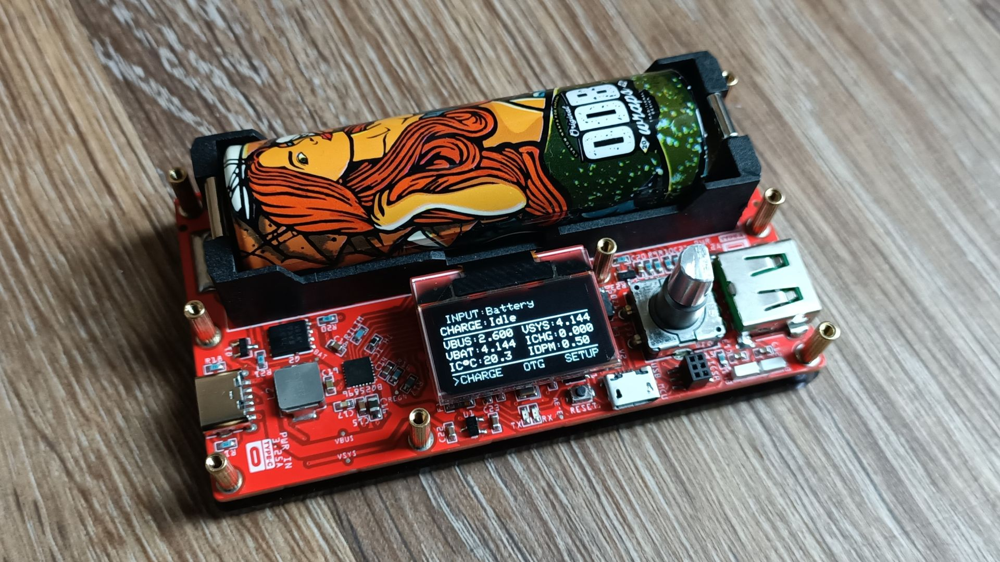

<H3>An advanced lithium battery charger and powerbank with a SSD1306 OLED display based on the BQ25896 IC and ATMEGA32U4 MCU.</H3>

 
Please check out one of these posts for more info: 
<a href="https://hackaday.io/project/190841-bq25896-atmega32u4-lithium-battery-charger">Hackaday</a> 
<a href="https://ratti3.blogspot.com/2023/04/bq25896-atmega32u4-lithium-battery.html">Blogspot</a> 
<a href="https://www.hackster.io/Ratti3/bq25896-atmega32u4-lithium-battery-charger-with-powerbank-684db7">Hackster</a>
  
You will also find the Gerbers and Pick & Place files I used in the Gerber folder. You can get the latest schematics and generate your own gerbers using the EasyEDA links below. 
<a href="https://oshwlab.com/ratti3/bq25896-lithium-battery-charger-with-oled-display">EasyEDA Main PCB and BOM</a> 
<a href="https://oshwlab.com/ratti3/ssd1306-0-96-i2c-oled-display">EasyEDA OLED PCB and BOM</a>
  

Check out the Youtube Video for this project: 

  
 
 
 
 

